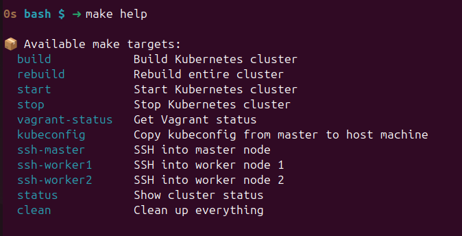
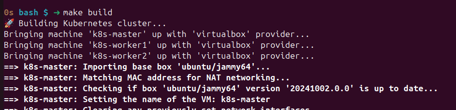
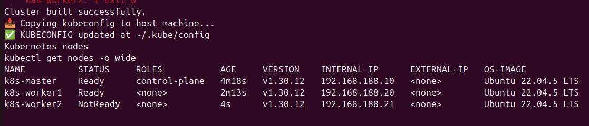
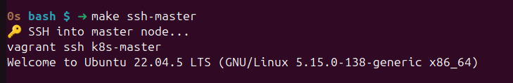
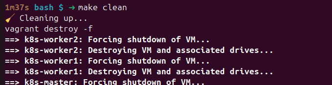

# Kubernetes

This repo contains the code to build a K8s cluster using Vagrant.

Steps:

```shell
make help
```



Your vagrant_config.yaml will need to look like below.

```yaml
nodes:
  k8s-master:
    ip: ip_address
    role: master
  k8s-worker1:
    ip: ip_address
    role: worker
  k8s-worker2:
    ip: ip_address
    role: worker
```

```shell
# This will build a fresh cluster and copy the kube configuration locally.
make build
```



___


```shell
# To SSH into the nodes
make ssh-[ master | worker1 | worker2 ]
```



```shell
# Destroys the cluster and removes the local kube configuration.
make clean
```

