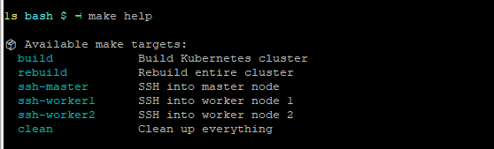
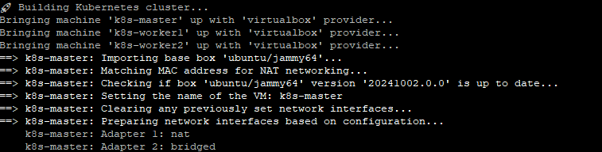
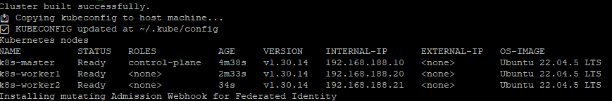
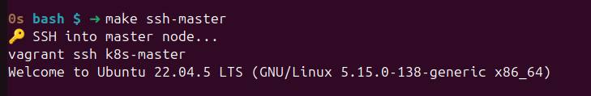
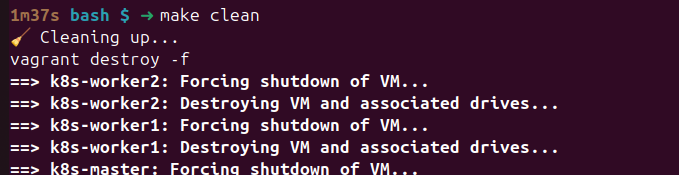

# Kubernetes

## Versions

### v1.0.0

This repo contains the code to build a K8s cluster using Vagrant.

The cluster comprises of....
 - 3 nodes; 1 node runs all control plane components and 2 worker nodes
 - CNI uses flannel
 - Kube VIP load balancer and kube VIP cloud controller
 - NGINX Ingress controller

### v1.1.0

Added Federated Identity functionality. 

This requires the steps documented [here](https://azure.github.io/azure-workload-identity/docs/introduction.html) are followed...but in summary

- Create a RSA key pair

```shell
# Generate a private key
openssl genrsa -out sa.key 2048

# Generate a public key from the private key
openssl rsa -in sa.key -pubout -out sa.pub
```

- Create a Storage Account with container e.g. oidc
- Generate the discovery document
- Upload the discovery document to the container above
  - .well-known/openid-configuration
- Generate a JWKS document

```shell
azwi jwks --public-keys sa.pub --output-file ./configuration/jwks.json
```

- Upload the JWKS document to the container above
  - openid/v1/jwks

- Configure Kubenetes to use Federated Identity

*The RSA keys must reside in the manifests folder...the script will copy them into the correct location as defined in `kubeadm-config.yaml`.*

```yaml
apiVersion: kubeadm.k8s.io/v1beta3
kind: ClusterConfiguration
...
apiServer:
  extraArgs:
    service-account-signing-key-file: "/etc/kubernetes/pki/sa.key"
    service-account-key-file: "/etc/kubernetes/pki/sa.pub"
    ...
  ...
...
```

# Steps

```shell
make help
```



Your vagrant_config.yaml will need to look like below.

```yaml
nodes:
  k8s-master:
    ip: ip_address
    role: master
  k8s-worker1:
    ip: ip_address
    role: worker
  k8s-worker2:
    ip: ip_address
    role: worker
```

**NOTE**: You'll be prompted for your Azure Tenant GUID for Federated Identity functionality.

```shell
# This will build a fresh cluster and copy the kube configuration locally.
make build
```



___


```shell
# To SSH into the nodes
make ssh-[ master | worker1 | worker2 ]
```



```shell
# Destroys the cluster and removes the local kube configuration.
make clean
```

